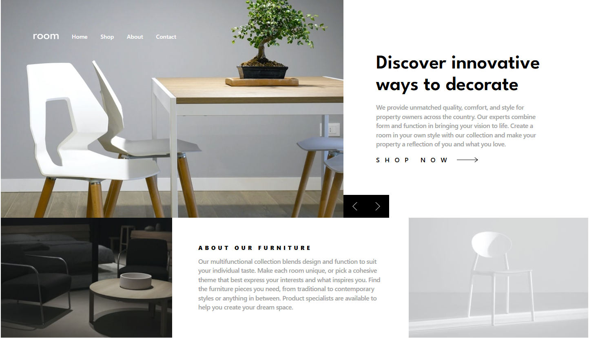
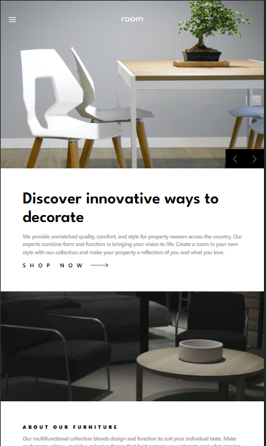
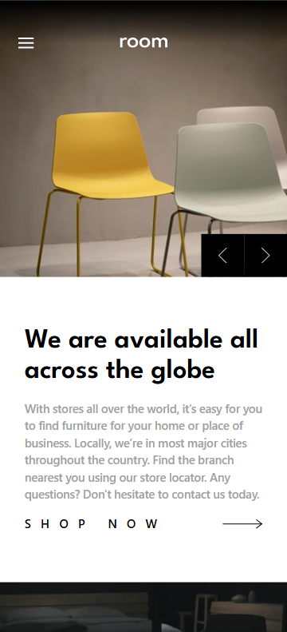

# Frontend Mentor - Room homepage solution

This is a solution to the [Room homepage challenge on Frontend Mentor](https://www.frontendmentor.io/challenges/room-homepage-BtdBY_ENq). Frontend Mentor challenges help you improve your coding skills by building realistic projects. 

## Table of contents

- [Overview](#overview)
  - [The challenge](#the-challenge)
  - [Screenshot](#screenshot)
  - [Links](#links)
- [My process](#my-process)
  - [Built with](#built-with)
  - [What I learned](#what-i-learned)
  - [Continued development](#continued-development)
  - [Useful resources](#useful-resources)
- [Author](#author)
- [Acknowledgments](#acknowledgments)

**Note: Delete this note and update the table of contents based on what sections you keep.**

## Overview

### The challenge

Users should be able to:

- View the optimal layout for the site depending on their device's screen size
- See hover states for all interactive elements on the page
- Navigate the slider using either their mouse/trackpad or keyboard

### Screenshot

### Links

- Solution URL: [Add solution URL here](https://your-solution-url.com)
- Live Site URL: [Add live site URL here](https://your-live-site-url.com)

## My process

### Built with

- Semantic HTML5 markup
- Tailwindcss
- Flexbox
- Mobile-first workflow
- JavaScript

### What I learned

**What are the challenges of this project? you may ask**
- So through this project I am working with Tailwindcss for styling, and while I am not facing a direct issue, there are two main challenges here:
  1. knowing and getting used to the property names in tailwind (which requires frequent searching).
  2. managing the html file (or at least reading it) with each div having a long list of classes.

- Another one which I first thought is easy was positioning, the nav list/burger and logo are absolutely positioned in this project. The challenge happened when I started trying to figure ut how to position the "Left, Right" buttons for the hero gallery, its even more challenging with the fact that has to be at "different spots" in different views. *I still didnt figure it out by the time of writing this*.

- JS or HTML gallery. I know for fact that both are technically doable. HTML is technically easier but will result in an HTML file that is both too long with elements repeated which I believe is impractical. The other way is to use one html element and then populate content in that element using JavaScript, *I know it could be more challenging to implement but its a challenge I am willing to take*.

*updating a few days later* I did the gallery with JS and have gotten my hands dirtly with tailwindcss

It was a hustle but the project is complete now, I also tried to cheat (checking other people's solutions) but when I checked a few, I honstly wasnt satisfied with their outcome. 

Will use tailwind again, thats possible, yes its useful, but it takes time to get used to by itself and I am not happy with the long class lists.

### Continued development

- I think there is more to tailwindcss like funtions and directives which can elevate the quality of work, will sure learn to use them going forward if I decided to do a future project with tailwindcss.

**Note: Delete this note and the content within this section and replace with your own plans for continued development.**

## Author

- Website - [Add your name here](https://www.your-site.com)
- Frontend Mentor - [@yourusername](https://www.frontendmentor.io/profile/yourusername)
- Twitter - [@yourusername](https://www.twitter.com/yourusername)

